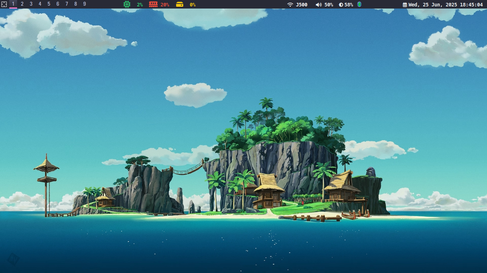
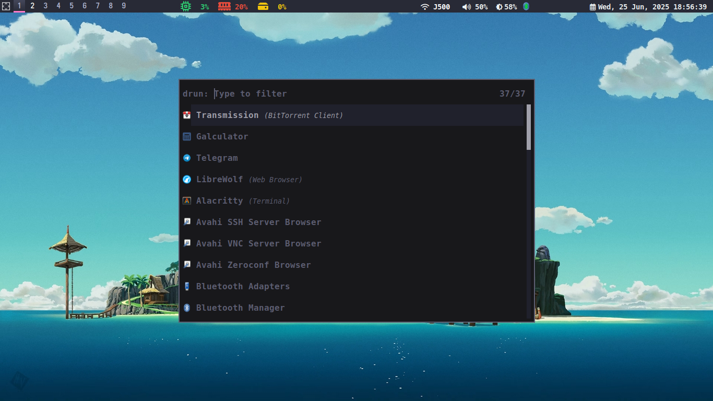

This is my current Arch Linux setup with install scripts and some dotfiles.

It is only for my personal use. I've been running this as my daily driver and works well without any issues.

My setup uses Qtile (Window manager), Ly (desktop manager or login manager), xorg (display server), rofi (application runner), i3lock (screen lock)

The install scripts have hard coded values for hostname and disk configuration. If you decide to use the scripts, make sure to go through and make changes. (Always test-run the scripts in a VM before running on live hardware)

Example using curl to download the script inside arch install medium:

`curl -O https://raw.githubusercontent.com/BennyThadikaran/arch-install/refs/heads/main/install_script/partition.sh`

`chmod +x partition.sh`

Assume you're using a bootable pendrive with enough disk space, you can partition the excess space as FAT32 or ext4. This allows storing the install scripts and other config files for use during installation.

**TODO:** Update instructions on partitioning pendrive

## Order of Operations

1. Run `partition.sh /dev/sda`

2. Install packages

`pacstrap /mnt $(< base_packages.txt) $(< other_packages.txt)`

- `base_packages` is the minimal required to install arch. Edit the specific kernel you want installed.
- `other_packages` contain my personal choice of packages. Some are required for qtile widgets. 

3. Generate file system table and chroot into /mnt

```
genfstab -U /mnt >>/mnt/etc/fstab
arch-chroot /mnt
```

5. Run `post_chroot.sh <username>`

6. Exit the chroot and unmount

```
exit
umount -R /mnt
reboot now
```

## Post Install and reboot

### Setup user folder encryption

1. Login as root

2. Once reboot is complete, qtile should run with default configuration and terminal can be accessed with `SUPER + Enter`

3. Run the below commands to setup encryption of /home/username. (Ensure same password as user login)

```
fscrypt setup --force
fscrypt setup /home
mkdir /home/<user>.bak
fscrypt encrypt /home/<user>.bak
cp -a -T /home/<user> /home/<user>.bak
rm -rf /home/<user>
mv /home/<user>.bak /home/<user>
```

4. Add the below lines `/etc/pam.d/system-login` to allow decryption at login.

```bash
auth optional pam_fscrypt.so
session optional pam_fscrypt.so
```

5. Reboot and login as `user`. Run `fscrypt status /home/user` to check status

Finally its a good idea to run `pacman -S --needed $(< other_packages.txt)` to install any packages that failed to install earlier.

## Final steps

1. Enable firewall

```
doas ufw enable
doas ufw logging off
doas systemctl enable ufw.service
```

2. Move contents of .config folder to `~/.config` and scripts folder to your HOME folder.
   - Make sure `~/.config/qtile/autostart.sh` and bash scripts in `~/scripts/` are made executable.
   - Edit xrandr settings in `autostart.sh` to set the correct screensize.
   - Install [MesloLG Nerd font](https://www.nerdfonts.com/font-downloads) - Required for Qtile bar
   - Press `SUPER + SHIFT + r` to restart Qtile with new config

3. Optional optimisations and enhancements

  - Add `noatime,commit=60` to `/etc/fstab`. See [Disabling_access_time_update](https://wiki.archlinux.org/title/Ext4#Disabling_access_time_update) and [Increasing commit interval](https://wiki.archlinux.org/title/Ext4#Increasing_commit_interval)
  - Edit `/etc/pacman.conf`, increase `ParallelDownloads=8` (Set to CPU cores count) and uncomment `color` for colored output.

  - Edit `/etc/default/grub` and set `GRUB_TIMEOUT=0`. Run `grub-mkconfig -o /boot/grub/grub.cfg` to update changes.

## Wallpapers and icon themes

- [LagrangianLad/arch-minimal-wallpapers](https://github.com/LagrangianLad/arch-minimal-wallpapers)
- [D3Ext/aesthetic-wallpapers](https://github.com/D3Ext/aesthetic-wallpapers)
- [Fausto-Korpsvart/Gruvbox-GTK-Theme](https://github.com/Fausto-Korpsvart/Gruvbox-GTK-Theme)

## Rofi theme

I use the Murz theme (with some modifications) [Murzchnvok/rofi-collection](https://github.com/Murzchnvok/rofi-collection)
